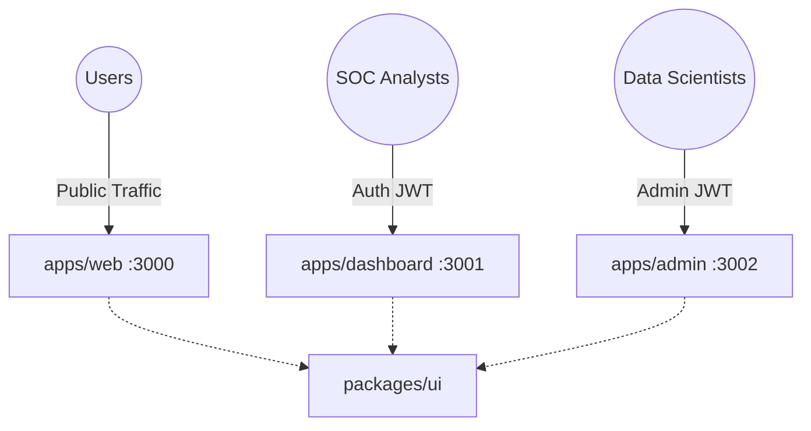

# 09 — Enterprise UI Architecture & Modular Design

> **Overview** | This document details the comprehensive frontend overhaul that transformed XAI-Guard from a collection of prototype interfaces into a complete, modular, and production-ready enterprise suite. 

The XAI-Guard frontend is structured as a **Modular Monolith** using Turborepo. It explicitly separates the concerns of different user personas into physically isolated Next.js applications while sharing core brand identities and components through a centralized UI package.

---

## 🏗️ 1. Monorepo Frontend Strategy

To enforce strict security boundaries and optimize performance, the frontend is divided into three isolated Next.js applications:

1. **`apps/web` (Port 3000):** The public-facing Marketing and Documentation site. Optimized for SEO, conversion, and static generation.
2. **`apps/dashboard` (Port 3001):** The SOC Analyst Portal. Highly dynamic, WebSocket-driven, and focused on real-time threat triage.
3. **`apps/admin` (Port 3002):** The Data Science & MLOps Console. Heavily privileged access, focused on Model Registry management and dataset drift analysis.

---

## 🧩 2. Shared Component Library (`packages/ui`)

To ensure design consistency across all three applications without duplicating code, we leverage the `@xaiguard/ui` workspace.

### Core Extracted Components:
- **Authentication Forms:** `LoginForm` and `SignupForm`. These highly styled, enterprise-ready authentication cards are built once in the UI package and consumed by both `apps/web` (for public signups) and internal portals.
- **Domain Indicators:** Components like `SeverityBadge` and `MitreBadge` enforce uniform threat visualizations whether viewed by a SOC Analyst or an Admin.
- **XAI Visualizers:** `FeatureContributionBar` isolates complex SHAP/LIME rendering logic from the main application layout.

---

## 🎨 3. Persona-Driven Layouts

Each application implements a bespoke `layout.tsx` tailored strictly to the workflow of its target user.

### A. The Marketing Experience (`apps/web`)
- **Glassmorphism Navigation:** A sticky, backdrop-blurred header (`bg-background/95 backdrop-blur`) providing seamless navigation across product features, pricing, and company info.
- **Conversion-Optimized Hero:** Heavy typography, gradient text (`bg-gradient-to-r from-blue-500 to-emerald-500`), and prominent call-to-action buttons linking directly to the Dashboard portal.
- **Route Groups:** Uses route groups like `/(website)/pricing` and `/(auth)/login` to maintain clean URL structures while applying different layout shells.

### B. The SOC Analyst Workspace (`apps/dashboard`)
- **Application Shell:** Implements a full-height (`h-screen overflow-hidden`) grid, maximizing vertical space for the Alert Feed.
- **Sidebar Navigation:** Persistent left-hand sidebar containing quick links to the Live Feed, Threat History, and System Health.
- **Context Header:** A sticky top navigation bar featuring real-time notification bells and the active user's profile/tier.

### C. The MLOps Console (`apps/admin`)
- **Strict Role-Based Layout:** Inherits the enterprise shell from the Dashboard but replaces Analyst tools with Model Registry, Drift Analysis, and System Metrics.
- **RBAC Middleware:** `apps/admin/middleware.ts` enforces strict token decryption. If `payload.role !== 'admin'`, the user is hard-rejected from loading the layout entirely, isolating sensitive ML infrastructure from standard security analysts.

---

## 🔒 4. Authentication Routing & Flow

Authentication pages are kept isolated from the main dashboard layouts by utilizing Next.js **Route Groups**. 

By placing the login page at `apps/dashboard/app/(auth)/login/page.tsx` and the dashboard at `apps/dashboard/app/(dashboard)/page.tsx`, the `layout.tsx` of the dashboard is not applied to the login page. This allows the login page to be a clean, full-screen, focused experience free of sidebars or navigation headers. 

**Workflow:**
1. User clicks "Get Started" on `apps/web`.
2. Redirected to `apps/web/app/(auth)/signup`.
3. Upon successful registration, token is set in HttpOnly cookies.
4. User is redirected to `apps/dashboard`.
5. Dashboard `middleware.ts` verifies token and renders the SOC Analyst layout.
