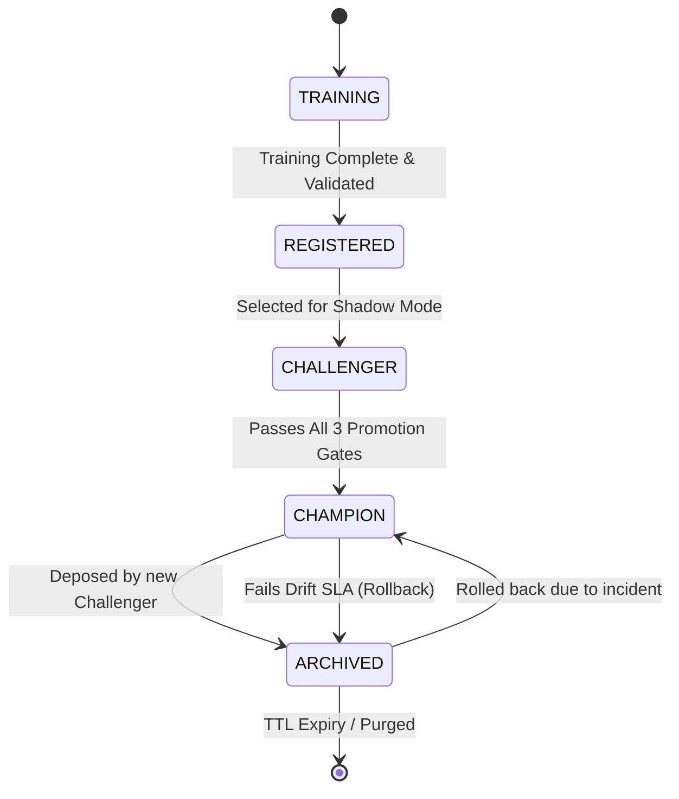

# XAI-Guard: Champion/Challenger Promotion Policy

To ensure the XAI-Guard platform safely and autonomously improves over time without compromising production network security, all model deployments are governed by a strict, statistically rigorous Champion/Challenger lifecycle. Manual ad-hoc deployments are explicitly forbidden; models must mathematically earn promotion.

---

## 1. Model Lifecycle State Machine

Every model artifact tracked in the MLflow Model Registry exists in exactly one of the following states:

- **`TRAINING`**: Active optimization loop in MLflow.
- **`REGISTERED`**: Frozen artifact stored in MinIO, pending selection.
- **`CHALLENGER`**: Actively deployed in Shadow Mode alongside the Champion.
- **`CHAMPION`**: The single production model synchronously serving all live API traffic.
- **`ARCHIVED`**: A deprecated model retained for rollback capabilities.

---

## 2. Shadow Evaluation Mode

When a model transitions to `CHALLENGER`, it is loaded into memory on the inference servers alongside the reigning `CHAMPION`. 
- **Execution:** The inference API duplicates every incoming HTTP/WebSocket `POST /v1/events` payload.
- **Synchronous Path:** The `CHAMPION` synchronously computes the prediction and returns it to the client (satisfying the $<100ms$ SLA).
- **Asynchronous Path:** The `CHALLENGER` computes its prediction on a background Celery task. Its output is flagged as `is_shadow = True` and persisted to the PostgreSQL `predictions` table. **The Challenger's output is NEVER returned to the client.**

---

## 3. Nightly Automated Comparison Window

At `02:00 UTC` daily, a scheduled cron job aggregates the last 24 hours of Shadow (`CHALLENGER`) versus Live (`CHAMPION`) predictions. 
- The system attempts to join these predictions against ground-truth feedback (if provided by SOC analysts via the dashboard).
- If ground-truth is unavailable, the system calculates relative anomaly disagreement and Maximum Mean Discrepancy (MMD) feature drift.

---

## 4. The Promotion Gates (The "Strict-AND" Rule)

To trigger an automated promotion from `CHALLENGER` to `CHAMPION`, the Challenger model must mathematically pass **ALL THREE** of the following gates during the nightly comparison window. Failure on a single gate results in immediate rejection.

### Gate 1: The Performance Gate
The Challenger must demonstrate a non-trivial improvement in predictive power to justify the operational risk of a swap.
- **Rule:** $\Delta F1_{macro} \ge +0.020$ **AND** $\Delta ROC\text{-}AUC \ge +0.010$.

### Gate 2: The Statistical Significance Gate
The performance improvement must not be the result of stochastic variance or favorable sampling.
- **Rule:** The discrepancy in correct predictions between the Champion and Challenger must pass a **McNemar's Test** with $p < 0.05$. 
- *Note:* Because we are evaluating across a 7-class taxonomy, a Bonferroni correction ($\alpha = 0.05 / 7$) is automatically applied to prevent Type I errors in multi-class significance testing.

### Gate 3: The Latency Budget Gate
The Challenger must prove it is operationally viable on the live CPU edge infrastructure.
- **Rule:** The Challenger's empirical $P99$ Inference Latency over the last 24 hours of shadow execution must remain strictly $\le 100\text{ms}$.

---

## 5. Auto-Promotion Trigger & Process

If the Challenger passes all three gates, the XAI-Guard Registry Module executes a 4-step atomic promotion sequence:
1. **Label Swap:** The MLflow alias `champion` is moved to the Challenger's run ID. The old Champion is labeled `archived`.
2. **Database Update:** The `model_registry` table updates the `status` ENUM for both models.
3. **Warm-Up:** The API spins up a new inference worker thread, loads the new Champion into memory, and passes 1,000 dummy tensors to initialize CPU caches.
4. **Traffic Cutover:** The API router atomically swaps the pointer. Subsequent HTTP requests are routed to the new Champion.

---

## 6. Incident Rollback Procedure

Safety is paramount. The system continuously monitors the live Champion's health.
- **Trigger:** If the Champion's MMD Drift Score crosses the `CRITICAL` threshold (indicating it is completely failing to recognize the current network topology), or if its $P99$ Latency breaches 200ms for more than 5 consecutive minutes.
- **Action:** The API automatically executes `POST /v1/models/rollback`.
- **Resolution:** The system instantly retrieves the most recent `ARCHIVED` model from MinIO, points live traffic to it, and alerts the SOC platform engineering team via webhook.
