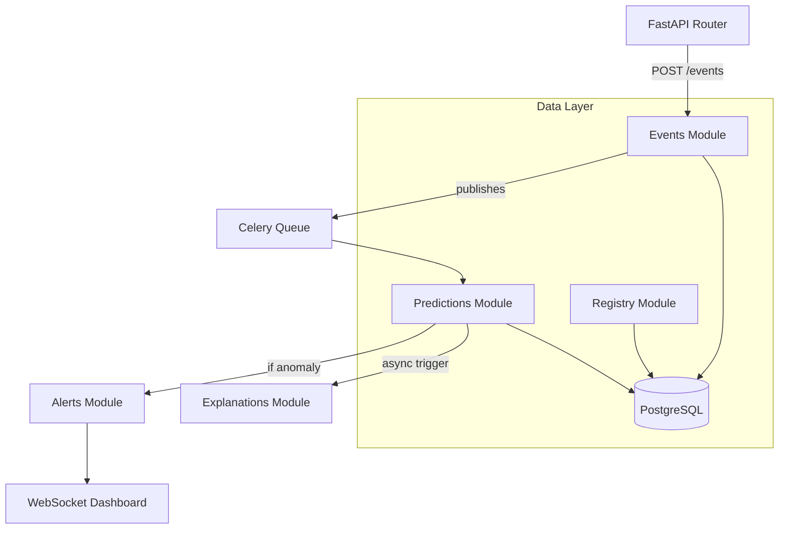

# XAI-Guard Module Catalogue & Boundary Rules

To prevent our FastAPI backend from degrading into a Big Ball of Mud, we enforce strict domain boundaries. Modules may only communicate via public interfaces (`service.py`) and must never import another module's SQLAlchemy models directly.

## Module Boundaries

| Module | Ownership Scope | Public Interface | Celery Tasks | Forbidden Imports |
|--------|----------------|------------------|--------------|-------------------|
| `core` | DB engine, Config, Logging, Exception Handlers | `get_db()`, `settings` | None | ALL other modules |
| `auth` | Users, JWTs, RBAC, Audit Logs | `verify_token()`, `log_audit()` | None | `events`, `predictions` |
| `events` | Security Events, deduplication hash | `ingest_event()` | `process_event` | `predictions`, `models` |
| `predictions` | ML Inference, confidence thresholds | `predict()` | `batch_predict` | `auth`, `alerts` |
| `explanations`| SHAP/LIME computation | `generate_xai()` | `compute_shap` | `auth`, `events` |
| `registry` | Model versions, Champion/Challenger status | `get_champion()`, `promote()` | `nightly_eval` | `alerts`, `auth` |
| `alerts` | Severity routing, WebSocket broadcasting | `trigger_alert()` | None | `models`, `explanations`|
| `drift` | MMD Drift Reports | `calculate_drift()` | `drift_monitor`| `auth`, `alerts` |
| `threat_intel`| AbuseIPDB, MITRE taxonomy | `enrich_ip()` | `refresh_tor`| `events`, `models` |

## Architecture

