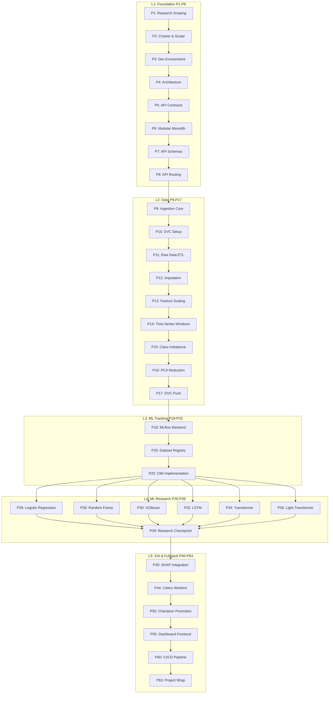

# Phase Dependency Map

**Critical Path:** P1 → P17 (Data) → P25 (Interface) → P34 (Transformer) → P39 (Checkpoint) → P44 (Celery) → P55 (Dashboard) → P63 (Finish).
**Parallelization:** Phases 26 through 38 (The six ML models) can be executed concurrently by separate research teams.
